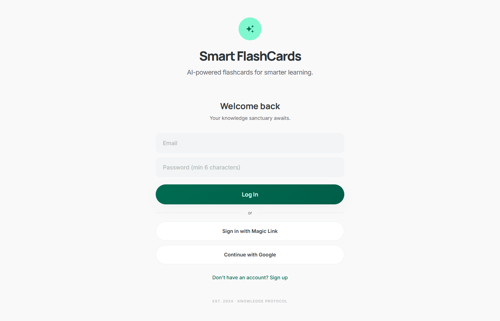
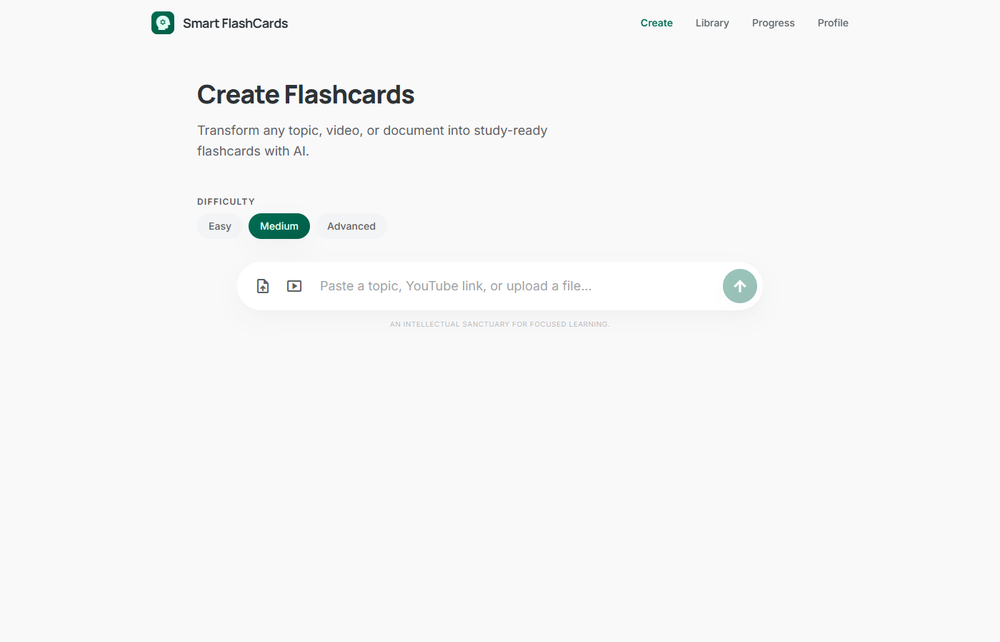
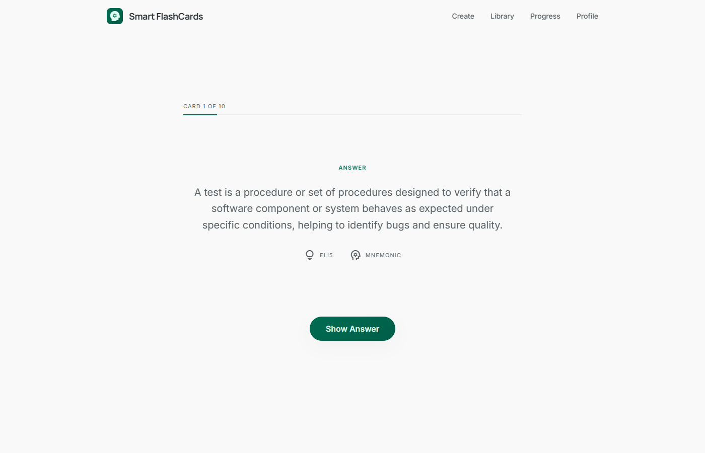

# Smart FlashCards

Turn any topic, PDF, pasted text, or YouTube video into exam-grade flashcards with spaced repetition.

**Live app:** [smart-flashcards-nine.vercel.app](https://smart-flashcards-nine.vercel.app)

---

## What it does

- **Generate from anywhere** — type a topic, paste text, upload a PDF, or drop a YouTube URL
- **Exam-grade cards** — the AI prompt targets USMLE, bar, and board-exam depth with domain detection (medical, legal, scientific, humanities, technical)
- **Smart card counts** — difficulty and source length auto-decide how many cards to generate
- **Anki-style spaced repetition** — rate each card Again / Hard / Good / Easy; intervals adapt
- **Interview prep mode** — tailored question style for role/topic practice
- **Progress tracking** — streaks, session history, and per-deck progress

## Screenshots

| Home | Generate | Study |
|------|----------|-------|
|  |  |  |

## Tech stack

- **Frontend:** React 19 + Vite + Tailwind v4 + React Router
- **Backend:** Supabase (Postgres, Auth, Edge Functions)
- **AI:** Claude via Supabase Edge Functions (streaming SSE)
- **PDF parsing:** pdfjs-dist (client-side)
- **Hosting:** Vercel

## Run locally

```bash
git clone https://github.com/Sparsh22jn/smart-flashcards.git
cd smart-flashcards
npm install
cp .env.example .env   # fill in Supabase URL + anon key
npm run dev            # http://localhost:5173
```

### Supabase setup

Edge functions and schema live in [`supabase/`](supabase/). Deploy with the Supabase CLI:

```bash
supabase link --project-ref <your-ref>
supabase db push
supabase functions deploy generate
```

You'll need an `ANTHROPIC_API_KEY` set as a secret on your Supabase project.

## Project layout

```
src/
  pages/        # Home, Generate, Library, DeckDetail, Study, Progress, Settings
  components/   # FlashCard, RatingButtons, Layout, AuthScreen, LoadingScreen, ...
  lib/          # Supabase client, auth, data access
  core/         # Spaced-repetition scheduling
  contexts/     # Generation progress context
supabase/
  functions/generate/   # Claude-backed card generation (SSE streaming)
  migrations/           # Database schema
```

See [CHANGELOG.md](CHANGELOG.md) for release notes.
